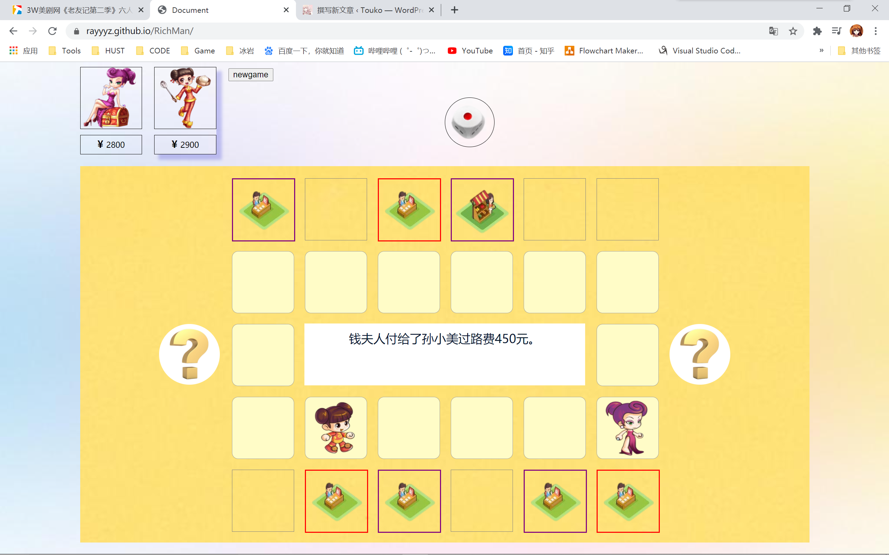

# richMan

游戏链接：
https://rayyyz.github.io/RichMan/

以下是遇到的主要问题和处理：

1. 买地/升级事件发生时，怎么判断点了哪个“yes"和“no”的按键？
   创建了两个事件bool变量,初始都为false,触发事件时值会变为true，此时按钮显示出来，根据对应变量进行事件处理，处理完成后事件变量变回false;
   在事件触发同时在exchangeTurn()即角色切换函数中进行判断，假设变量都为false则证明事件处理完毕，角色切换；否则利用setTimeOut()进行轮询检查（每500ms调用一次exchangeTurn()）。

2. 上传github后使用github pages搭建静态网页，但是骰子和建筑的图片显示不出来？
   原因是通过jQuery使得图片css属性变为:`background-image: url('../img/骰子2.png)`虽然相对路径在自己调试的时候没有错，但是利用f12查看了图片信息，初始加载图片的url都是`rayyyz.github.io/RichMan/img/xxx.png`而变换后的url变成了`rayyyz.github.io/img/xxx.png`，缺少了一层路径。

   解决方法:将所有图片路径都改成了`https://rayyyz.github.io/RichMan/img/xxx.png`的形式,虽然加载会有一些慢但是问题解决了

3. 点击newgame后游戏不会重置/刷新
   （待解决）